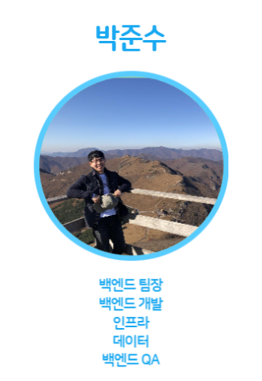

- 👋 Hi, I’m @qwnstn
- 👀 I’m interested in ... 백엔드 개발, 인프라 구성
- 🌱 I’m currently learning ... Java Spring Boot, NginX, Certbot
- 💞️ I’m looking to collaborate on ... 
- 📫 How to reach me ... qwnstn@naver.com

<!---
qwnstn/qwnstn is a ✨ special ✨ repository because its `README.md` (this file) appears on your GitHub profile.
You can click the Preview link to take a look at your changes.
--->

20230220 ~ 20230407 SSAFY 특화 프로젝트

- Java Spring Boot
  - CRUD
- AWS EC2 Linux
  - UFW
  - Jenkins
  - Docker
  - Docker Compose
- Data
  - 데이터 수집
  - Pyhton 데이터 전처리

